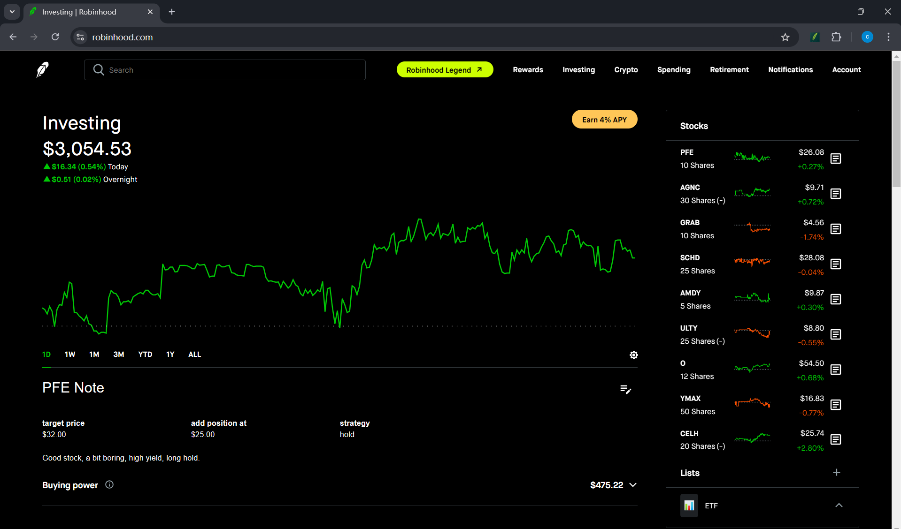
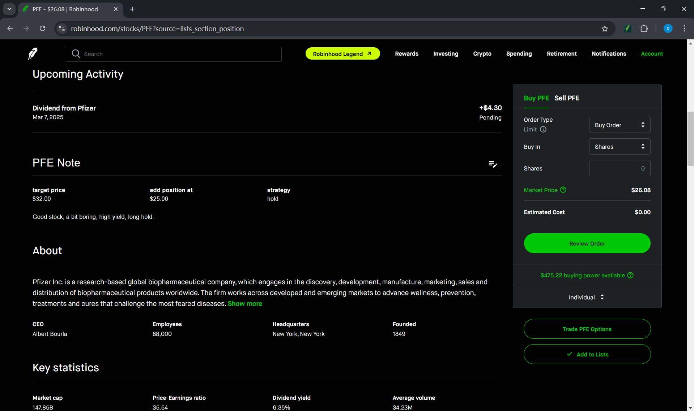
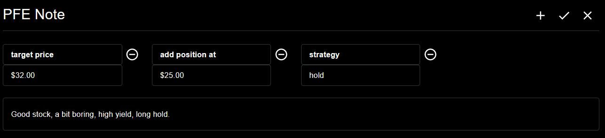
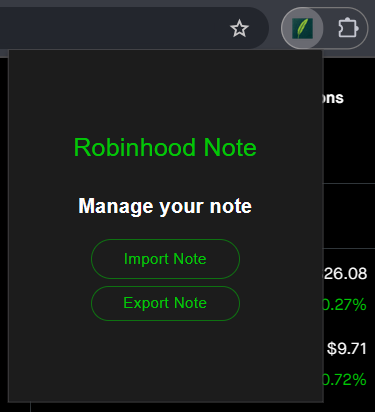

<div align="center">
    <h1>Robinhood Note</h1>
    
    <p>A note-taking📗 extension for Robinhood
</p>
</div>

---

This is a web extension developed for Robinhood, based on the [WXT](https://wxt.dev/) + React + Material-UI

## 🎉 Features

- [x] Take note on Robinhood website
- [x] Export note to json file
- [x] Import note from json file
- [x] UI almost the same as Robinhood


## 🤺 Usage

### Option1: Install Release File 🍰

1. Download the latest release file from [here](https://github.com/chengxilo/robinhood-note/releases/download/v0.0.1/robinhood-note-chrome-mv3.zip)

2. Unzip the file

3. Open `chrome://extensions/` in your browser, enable `Developer mode`, click `Load unpacked`,
   and select the `chrome-mv3` folder.

### Option2: Compile Source Code 🛠️

1. Clone the repository:
    ```bash
    git clone https://github.com/chengxilo/robinhood-note.git
    ```

2. Install dependencies:
    ```bash
    pnpm install
    ```

3. Build the source code:
    ```bash
    pnpm run build
    ```
   
4. Open `chrome://extensions/` in your browser, enable `Developer mode`, click `Load unpacked`, 
and select the `.output/chrome-mv3` folder in the **project directory**.


## 🧩 Screenshots

You can find it on your home page. You can choose the stock by clicking the icon on the right side.



It will also show the note on the stock detail page.



edit it, you can add/delete key-value pair and note content.



Click extension icon to open the popup, you can import/export your note by clicking the button.




## 🪁 Contributing

Pull requests are welcome. Feel free to...

- 📄 Revise documentation
- ✨ Add new features
- 🪲 Fix bugs
- 💡 Suggest improvements