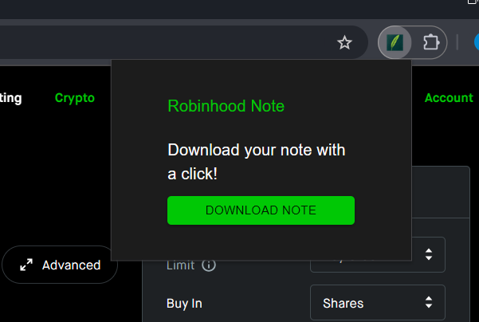

    <h1>Robinhood Note</h1>
    
    
A note-taking📗 extension for Robinhood

---

## 🎉 Features

- [x] Take note on Robinhood website
- [x] Export note to json file
- [ ] Import note from json file(coming soon)
- [x] UI almost the same as Robinhood

## 🤺 Usage

### Option1: Install Release File 🍰

### Option2: Compile Source Code 🛠️

## 🧩 Screenshots

You can find it on your home page. You can choose the stock by clicking the icon on the right side.

It will also show the note on the stock detail page.

edit it, you can add/delete key-value pair and note content.

Click extension icon to open the popup, you can download the note in json file.

## 🪁 Contributing

Pull requests are welcome. Feel free to...

- 📄 Revise documentation
- ✨ Add new features
- 🪲 Fix bugs
- 💡 Suggest improvements